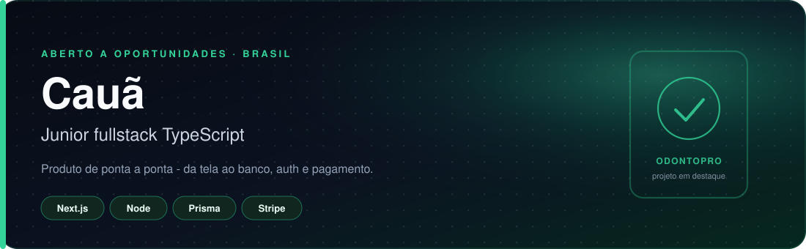
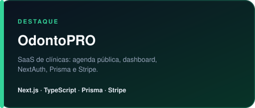
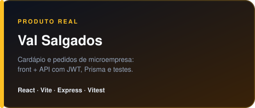
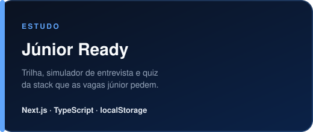

  

 

  
  
  

  

Construo produto de ponta a ponta: interface em React/Next.js, API em Node, banco com Prisma e PostgreSQL, autenticação e pagamento. Procuro vaga de **desenvolvedor júnior fullstack TypeScript** — o tipo de papel em que eu entrego feature, não só tela.

## Trabalho selecionado

<table>
  <tr>
    <td width="50%">
      
      

        Paciente marca horário no link público. Profissional gerencia agenda, serviços, perfil e assinatura. 
        <a href="https://odontopro-hazel.vercel.app">abrir o app</a> ·
        <a href="https://github.com/CauaFCamargo/odontoPRO">código</a>
      

    </td>
    <td width="50%">
      
      

        Cardápio de uma microempresa real, com API de pedidos, JWT e token público pra não vazar ID sequencial. 
        <a href="https://val-salgados-front.vercel.app">abrir o app</a> ·
        <a href="https://github.com/CauaFCamargo/val-salgados-api">API</a>
      

    </td>
  </tr>
  <tr>
    <td width="50%">
      
      

        12 módulos, simulador de entrevista e quiz da stack que as vagas júnior pedem. 
        <a href="https://github.com/CauaFCamargo/prep">código</a>
      

    </td>
    <td width="50%">
      
      

        REST com papéis, JWT, Prisma e testes de integração (Express + Jest). 
        <a href="https://github.com/CauaFCamargo/Api-sistema-de-entregas">código</a>
      

    </td>
  </tr>
</table>

  

## Stack que uso de verdade

Não é lista de curso. É o que aparece nos repositórios acima.

| | |
| --- | --- |
| **Front** | TypeScript, React, Next.js, Tailwind, formulários com Zod |
| **Back** | Node.js, Express, REST, JWT, NextAuth (OAuth Google/GitHub) |
| **Dados** | PostgreSQL, Prisma, modelagem e migrations |
| **Qualidade** | testes (Jest / Vitest / Supertest), TypeScript strict |
| **Produto** | Stripe, Cloudinary, Vercel |

Aprofundando o que as vagas ainda pedem além do que já entreguei: NestJS, SQL no dia a dia, e o básico de AWS / filas.

## Como eu trabalho

- Um projeto completo e explicável vale mais que dez tutoriais abandonados.
- README descreve o problema, a stack, como rodar e as decisões.
- Backend com schema (Zod), auth no middleware, e teste no caminho feliz e no erro.
- No Val Salgados o código respeita o negócio: token de acompanhamento em vez de ID sequencial, impressão só quando a loja pede.

  
  

Se você está recrutando para júnior fullstack TypeScript, comece pelo [OdontoPRO](https://odontopro-hazel.vercel.app) e pelo [código](https://github.com/CauaFCamargo/odontoPRO).

  <a href="https://github.com/CauaFCamargo">github.com/CauaFCamargo</a>

